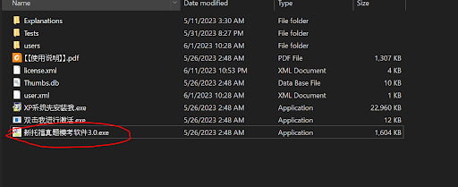
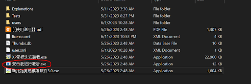
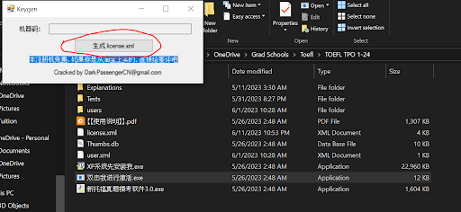

# TOEFL-prep
## Mushtari Sadia

### **My TOEFL scores**

- Total: 115/120

    Reading: 29/30
    Listening: 30/30
    Speaking: 30/30
    Writing: 26/30

- Total preparation time: 4-5 days

### **My Test Experience**
I gave my exam at the AAA centre, Banani. Overall environment was pretty good. A typical problem in toefl exams is that it becomes quite disturbing when others are in their speaking section, so be prepared for that. In my case, I finished the listening section quite fast so I was able to start my speaking section before everyone else around me (so I think I was the one who disturbed everyone xD). When everyone else started speaking, I was in the writing section and couldn't focus for 1-2 minutes.

Another thing that happened to me was, I was somehow getting less and less time for questions compared to the mock tests I gave at home. I guess this is a general thing that happens during tests. I even missed one question in the reading section because I was out of time. In the writing portion, I didn't have time to write conclusions (for both questions). I think this strongly affected my writing scores. So while you're practising at home, practice in a way that you have enough time to spare, because in the actual exam your pace becomes much slower. Also, in toefl exams there is a specific structure for scores. It won't matter how well you wrote if you didn’t write conclusions or didn’t use enough transitional words, etc. So make yourself familiar with the structures and something called toefl scoring rubrics.

### **My Preparation Steps**
<u>**Starting point**</u>

This video is a must watch. It describes the entire test. A lot of strategies were described in this video, all of which came in handy for me.

 -  https://youtu.be/7XA49rWNiqw

<u> **The Mock Test App** </u>

- https://buetedu-my.sharepoint.com/:f:/g/personal/maliha_wre_buet_ac_bd/Eh0i9rRIa3JPpCZQXjb0kVcB0YAiPvPFQILTI0448PKe0Q?e=hZMYCj

- Instructions:
  
    - Download the entire folder and open it on your computer
    Open the exe with 3.0 in it. That’s the test app.

        
    - Open the exe without 3.0 or XP in it. Then click on the license.xml button. Your test app is activated.
      
        
      
        

    There are 24 free mock tests here. Give as many as you can, I gave 5. The test app scores the reading and listening portion but doesn’t score the speaking and writing portion. For judging your own speaking, you can follow the strategies described in the video link I gave above. If it’s not enough, youtube has a LOT of videos. For judging your writing, chatGPT can be a handy tool. Ask the question this way:
    “Assess this essay according to toefl integrated/independent writing rubrics. Suggest improvements or corrections wherever necessary “

    **Another tip:** The test app fails to save the written essay sometimes. So what I did was, after writing one essay, exited the test, went to view answers -> writing -> switched between the independent/integrated a few times to load it -> copied it (ctrl+c) -> pasted in a text file outside -> then went back to the test and started the second question of writing.

    That’s it for my preparation. There are more resources below which I collected but never looked at (except for the first two links). I did make some notes, which you can find below the resources.

### **Resources**
- **Writing Resources**:
  
    [TOEFL Writing Questions (2023 edition) – Sample Essays and Questions | Test Resources (toeflresources.com)](https://www.toeflresources.com/sample-toefl-essays/)

- **Speaking Resources:**
  
    [Sample TOEFL Speaking Questions and Answers (2023 Update) | Test Resources (toeflresources.com)](https://www.toeflresources.com/speaking-section/toefl-speaking-samples/)

- **More videos:**
  
    https://www.youtube.com/c/NoteFullTOEFLMastery/videos

- **folder:**
  
    https://buetedu-my.sharepoint.com/:f:/g/personal/maliha_wre_buet_ac_bd/EovHVuVyA-JBjcIBYnwe_CAB9oWL2yYiOxt0JykXtndjmQ?e=iBulsx
